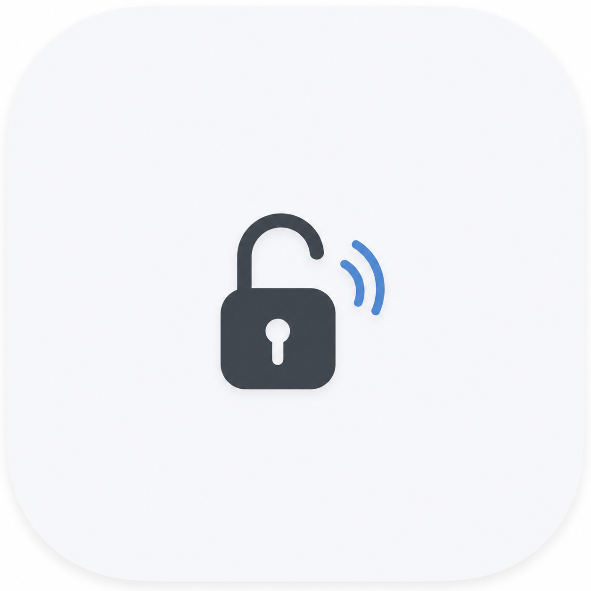

<p align="center">
  
</p>

<h1 align="center">Yila NFC Helper</h1>

<p align="center">
  <strong>An Android helper that fills the missing link between Yila Door and its own NFC URL.</strong>
</p>

<p align="center">
  
  
  
</p>

<p align="center">
  <a href="README.md">简体中文</a>
</p>

## What It Does

Yila NFC Helper is a minimal Android utility designed to work with the Yila Door app.

Yila Door uses NFC links such as `yila://frank.lee.com`, but the Android version of the Yila Door app does not properly handle this entry point. As a result, even when the NFC tag contains Yila's own link, tapping the tag with an Android phone does not directly enter Yila Door and trigger the door-opening flow.

Yila NFC Helper fills that gap: it receives the `yila://frank.lee.com` NFC launch event, then explicitly opens the Yila Door app so the previously broken entry point becomes usable again.

It does not provide a complex UI, does not run persistently in the background, and does not leave a card in recent tasks. It appears only when needed and exits immediately after forwarding the request.

## Why It Exists

The real-world door-opening flow on Android is often not smooth:

- You arrive at the door and still need to find the app.
- The app icon may be buried in a launcher folder, slowing down access.
- The NFC tag contains Yila's own `yila://frank.lee.com` link, but the Android version of Yila Door does not handle it correctly.
- The system recognizes the NFC tag, but the flow does not conveniently enter Yila Door and open the door automatically.

Yila NFC Helper solves this broken handoff: NFC links such as `yila://frank.lee.com` first enter the helper app, and the helper app then explicitly launches Yila Door.

## Who It Is For

- Android users who frequently use Yila Door.
- Users who want to place an NFC tag near the door for faster access.
- Users who do not want to install or configure a complex automation tool.

## How To Use

1. Install Yila NFC Helper.
2. Prepare an NFC tag.
3. Write the following content to the NFC tag:

   | Item | Value |
   | --- | --- |
   | URL / Link | `yila://frank.lee.com` |
   | Android app package | `com.juren233.nfcunlocker` |

4. Tap the NFC tag with an Android phone.
5. After the system recognizes the tag, Yila NFC Helper will launch Yila Door. On first launch, Android may show a chained-launch prompt. Choose always allow to keep future use smooth.

## Compatibility Notes

Android 16 introduced NFC Tag Intent preference controls. On startup, Yila NFC Helper attempts to check whether the current app is allowed to receive NFC tag events.

- If the system explicitly reports that NFC tag handling is not allowed, the app will prompt the user and open the system NFC preference page.
- If some ROMs throw `SecurityException` while querying the state, the app will not treat it as a disabled permission and will continue to work.

This is necessary because some Android 16 devices may fail the query with a permission error even though NFC tag launching still works correctly.

## What It Does Not Do

- It does not bypass or crack any access-control system.
- It does not bypass Yila Door login, authorization, or door-access permissions.
- It does not read, store, or upload access credentials.
- It does not run as a persistent background listener.
- It does not replace the Yila Door app.

## Development And Build

The project is built with Kotlin and Android Gradle Plugin. JDK 21 is recommended.

Release build command:

```powershell
pwsh -NoProfile -ExecutionPolicy Bypass -File scripts\build-release.ps1 -NoPause
```

After a successful build, the APK is available at:

```text
scripts/output/NFCunlocker-release.apk
```

## Key Files

| File | Description |
| --- | --- |
| `SetupActivity.kt` | Launcher entry point for readiness prompts and Android 16 NFC preference checks. |
| `RelayActivity.kt` | NFC forwarding entry point that launches Yila Door. |
| `AndroidManifest.xml` | Declares the NFC tag filter rules and no-recent-task behavior. |
| `scripts/build-release.ps1` | Release APK build script. |

## License

This project is licensed under Creative Commons Attribution-NonCommercial 4.0 International (CC BY-NC 4.0).

You may share and adapt this project with proper attribution, but you may not use it for commercial purposes. The full terms are governed by the official Creative Commons license. See [LICENSE.md](LICENSE.md).
